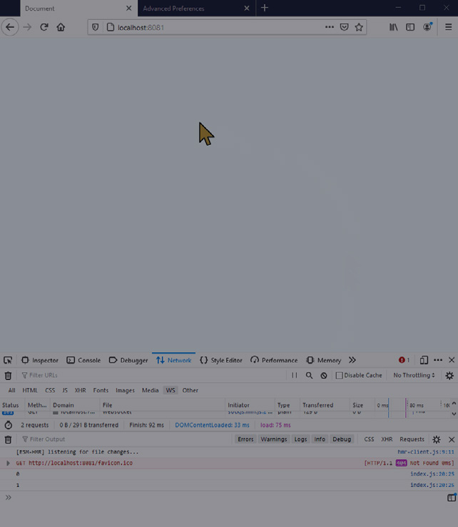
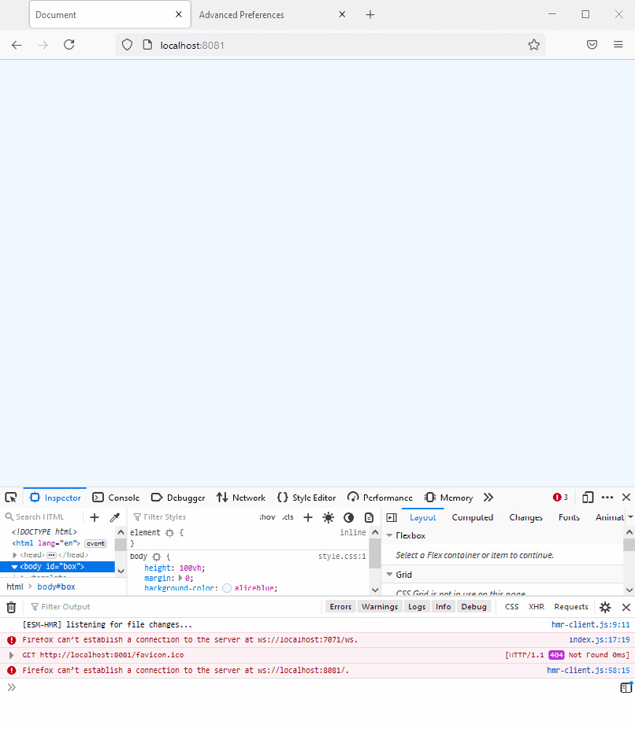
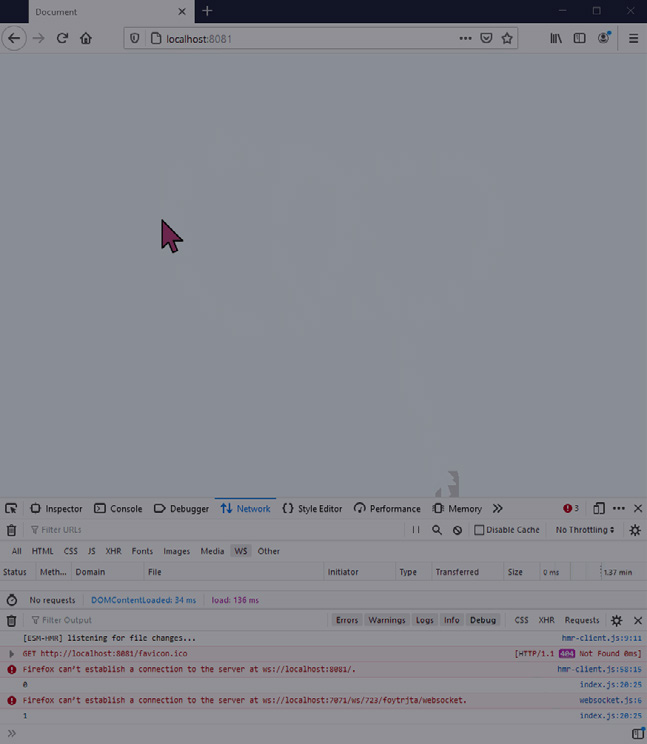

This chapter provides detailed, step-by-step instructions on building a realtime web app with WebSockets and Node.js - an interactive cursor position-sharing demo.

## Running the Demo

```bash
> git clone https://github.com/ably-labs/WebSockets-cursor-sharing.git
> npm install
> npm run start
```

This demo includes two applications: a web app that we serve through [Snowpack](https://www.snowpack.dev/), and a Node.js web server. The NPM start task spins up both the API and the web server.

The demo should look as depicted below:


*Figure 4.1: Realtime cursor movement powered by the ws WebSockets library*

However, if you are running the demo in a browser that does not support WebSockets (e.g., IE9 or below), or if you are restricted by particularly tight corporate proxies, you will get an error saying that the browser can't establish a connection:


*Figure 4.2: Error message returned by the browser when a WebSocket connection can't be established*

This is because the ws library offers no fallback transfer protocols if WebSockets are unavailable. If this is a requirement for your project, or you want to have a higher level of reliability of delivery for your messages, then you will need a library that offers multiple transfer protocols, such as SockJS.

## SockJS — a JavaScript library to provide WebSocket-like communication

SockJS is a library that mimics the native WebSocket API in browsers. Additionally, it will fall back to HTTP whenever a WebSocket fails to connect, or if the browser being used doesn't support WebSockets. Like ws, SockJS requires a server counterpart; its maintainers provide both a [JavaScript client library](https://github.com/sockjs/sockjs-client), and a [Node.js server library](https://github.com/sockjs/sockjs-node).

Using SockJS in the client is similar to the native WebSocket API, with a few small differences. We can swap out ws in the demo built previously and use SockJS instead to include fallback support.

### Updating the interactive cursor position sharing demo to use SockJS

To use SockJS in the client, we first need to load the SockJS JavaScript library from their CDN. In the head of the index.html document we built earlier, add the following line above the script include of index.js:

```html
<script src='https://cdn.jsdelivr.net/npm/sockjs-client@1/dist/sockjs.min.js' defer></script>
```

Note the `defer` keyword — it ensures that the SockJS library is loaded before index.js runs.

In the app/script.js file, we then update the JavaScript to use SockJS. Instead of the WebSocket object, we'll now use a SockJS object. Inside the connectToServer function, we'll establish the connection with the SockJS server:

```javascript
const ws = new SockJS('http://localhost:7071/ws');
```

SockJS requires a prefix path on the server URL. The rest of the app/script.js file requires no change.

Next, we have to update the API/script.js file to make our server use SockJS. This means changing the names of a few event hooks, but the API is very similar to ws.

First, we need to install sockjs-node. In your terminal run:

```bash
> npm install sockjs
```

Then we need to require the sockjs module and the built-in HTTP module from Node. Delete the line that requires ws and replace it with the following:

```javascript
const http = require('http');
const sockjs = require('sockjs');
```

We then change the declaration of wss to become:

```javascript
const wss = sockjs.createServer();
```

At the very bottom of the API/index.js file we'll create the HTTPS server and add the SockJS HTTP handlers:

```javascript
const server = http.createServer();
wss.installHandlers(server, {prefix: '/ws'});
server.listen(7071, '0.0.0.0');
```

We map the handlers to a prefix supplied in a configuration object ('/ws'). We tell the HTTP server to listen on port 7071 (arbitrarily chosen) on all the network interfaces on the machine.

The final job is to update the event names to work with SockJS:

```javascript
ws.on('message', /* ... */) will become ws.on('data', /* ... */)
client.send(outbound);      will become client.write(outbound);
```

And that's it, the demo will now run with WebSockets where they are supported; and where they aren't, it will use Comet long polling. This latter fallback option will show a slightly less smooth cursor movement, but it is more functional than no connection at all!

## Running the demo with SockJS

If you've been following along with the tutorial, then you can run:

```bash
> npm install
> npm run start
```

If not, you can clone a working version of the demo from: https://github.com/ably-labs/websockets-cursor-sharing/tree/sockjs.

```bash
> git clone -b sockjs https://github.com/ably-labs/WebSockets-cursor-sharing.git
> npm install
> npm run start
```

This demo includes two applications: a web app that we serve through [Snowpack](https://www.snowpack.dev/), and a Node.js web server. The NPM start task spins up both the API and the web server.

The demo should look as depicted below:


*Figure 4.3: Realtime cursor movement powered by the SockJS WebSockets library*

## Scaling the web app

You might notice that in both examples we're storing the state in the Node.js WebSocket server — there is a Map that keeps track of connected WebSockets and their associated metadata. This means that for the solution to work, and for every user to see one another, they have to be connected to the same WebSocket server.

The number of active users you can support is thus directly related to how much hardware your server has. Node.js is pretty good at managing concurrency, but once you reach a few hundred to a few thousand users, you're going to need to scale your hardware to keep all the users in sync.

Scaling vertically is often an expensive proposition, and you'll always be faced with a performance ceiling of the most powerful piece of hardware you can procure. Additionally, vertical scaling is not elastic, so you have to do it ahead of time. You should consider horizontal scaling, which is better in the long run — but also significantly more difficult. See *The scalability of your server layer* section in the next chapter for details.

## What makes WebSockets hard to scale?

WebSockets are fundamentally hard to scale because connections to your WebSocket server need to be persistent. And even once you've scaled your server layer, you also need to provide a solution for sharing data between the nodes. Connection state needs to be stored out-of-process — this usually involves using something like [Redis](https://redis.io/), or a traditional database, to ensure that all the nodes have the same view of state.

In addition to having to share state using additional technology, broadcasting to all subscribed clients becomes difficult, because any given WebSocketServer node knows only about the clients connected to itself.

There are multiple ways to solve this: either by using some form of direct connection between the cluster nodes that are handling the traffic, or by using an external pub/sub mechanism. This is sometimes called "adding a backplane" to your infrastructure, and is yet another moving part that makes scaling WebSockets difficult.

See Chapter 5: WebSockets at Scale for a more in-depth read about the engineering challenges involved in scaling WebSockets.
