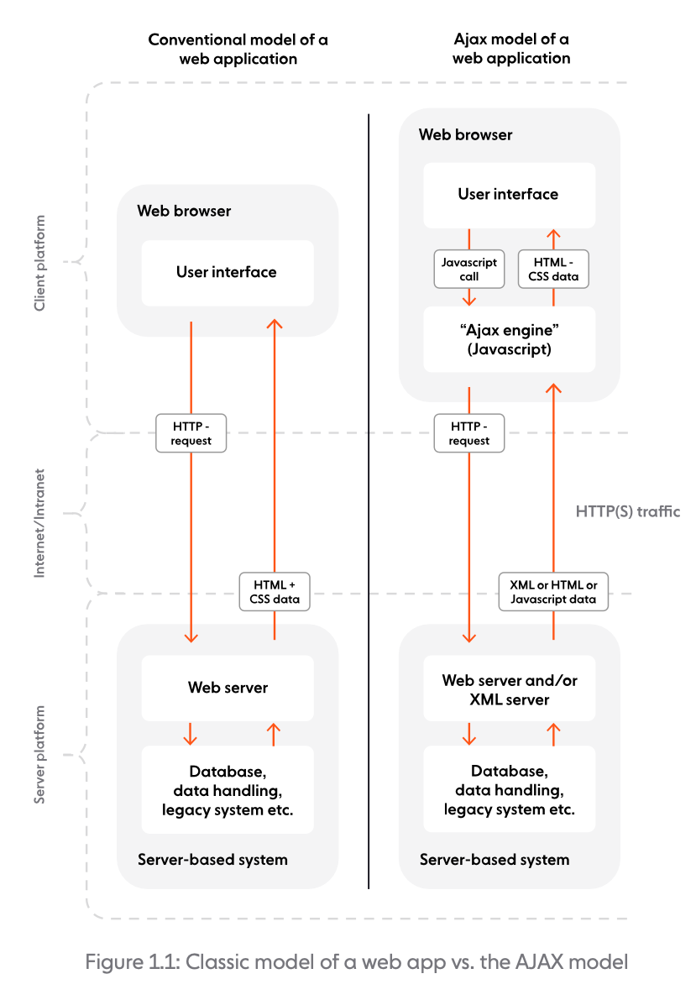
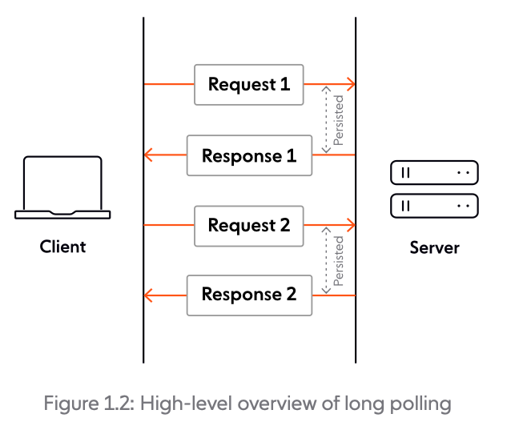
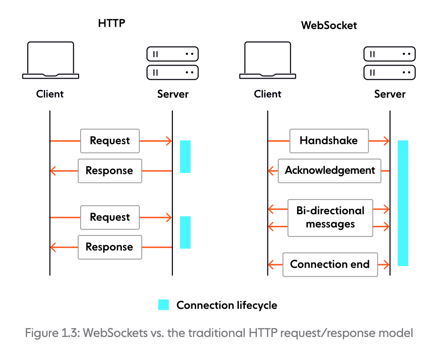

> During the 1990s, the web rapidly grew into the dominant way to exchange
> information. Increasing numbers of users became accustomed to the experience
> of browsing the web, while browser providers constantly released new features
> and enhancements.

The first realtime web apps started to appear in the 2000s, attempting to
deliver responsive, dynamic, and interactive end-user experiences. However, at
that time, the realtime web was difficult to achieve and slower than we're used
to nowadays; it was delivered by hacking existing HTTP-based technologies that
were not designed and optimized for realtime applications.

The challenge was significant. Developers were essentially forcing a protocol designed for document retrieval to handle continuous, bidirectional communication. This fundamental mismatch created numerous problems: excessive server resource consumption, unpredictable latency, and complex implementation patterns that were prone to failure. Early pioneers in this space had to develop creative workarounds, often involving multiple concurrent HTTP connections, complex state management systems, and sophisticated client-side buffering mechanisms to create the illusion of real-time communication.

These early attempts at real-time web functionality were characterized by high complexity and low reliability. Companies like Google, with their Gmail and Google Maps applications, invested heavily in overcoming these limitations, but the solutions remained fragile and resource-intensive. The technical debt accumulated from these workarounds often made applications harder to maintain and scale, creating a clear need for a purpose-built solution.

It quickly became obvious that a better alternative was needed. The web development community began recognizing that the future of interactive applications required a protocol designed from the ground up for bidirectional, low-latency communication. In this first chapter, we'll look at how web technologies evolved, culminating with the emergence of [WebSockets](https://ably.com/topic/websockets), a vastly superior improvement on HTTP for building realtime web apps.

## The World Wide Web is born

In 1989, while working at the European Organization for Nuclear Research (CERN)
as a software engineer, Tim Berners-Lee became frustrated with how difficult it
was to access information stored on different computers (and, on top of that,
running different types of software). This prompted Berners-Lee to develop a
project called "WorldWideWeb".

The problem Berners-Lee faced was more than just technical inconvenience—it was a fundamental barrier to scientific collaboration and knowledge sharing. At CERN, researchers were using various incompatible computer systems, each with their own file formats, networking protocols, and information retrieval methods. This fragmentation meant that valuable research data and documentation were effectively siloed, making cross-team collaboration cumbersome and inefficient. The existing solutions, such as file transfer protocols and email attachments, were inadequate for the scale and complexity of modern scientific research.

The project proposed a "web" of hypertext documents, which could be viewed by
browsers over the internet using a client-server architecture. The web had the
potential to connect the world in a way that was not previously possible, and
made it much easier for people everywhere to get information, share, and
communicate.

The revolutionary aspect of Berners-Lee's vision was not just the technology itself, but the philosophical approach: universal accessibility. Unlike proprietary systems that required specific software or hardware, the web was designed to be platform-agnostic and vendor-neutral. This democratization of information access would prove to be one of the web's most transformative characteristics, enabling a level of global information sharing that had never before been possible in human history.

Initially used at CERN, the web was soon made available to the
world, with the first websites for everyday use starting to appear in 1993-1994. The transition from internal research tool to global phenomenon was remarkably rapid, driven by the decision to make the web royalty-free and open to all. This open approach contrasted sharply with other emerging network technologies of the time, many of which were proprietary and required licensing fees.

Berners-Lee managed to create the web by combining two existing technologies:
hypertext and the internet. In the process, he developed three core building
blocks:

- **HTML**. The markup (formatting) language of the web.
- **URI**. An "address" (similar to a postal address) that is unique and used to
  identify each resource on the web.
- **HTTP**. Protocol used for requesting and receiving resources over the web.

This [initial version of HTTP](https://go.ably.com/wur) (commonly known as
[HTTP/0.9](https://go.ably.com/wur)) that Berners-Lee developed was incredibly
basic. Requests consisted of a single line and started with the only supported
method, `GET`, followed by the path to the resource:

```http
GET /mypage.html
```

The hypertext-only response was extremely simple as well:

```html
<html>
  My HTML page
</html>
```

There were no HTTP headers, status codes, URLs, or versioning, and the
connection was terminated immediately after receiving the response.

The simplicity of HTTP/0.9 was both its strength and its limitation. On one hand, the minimalist design made it easy to implement and understand, contributing to rapid adoption across different systems and platforms. The protocol could be implemented with basic networking knowledge, making it accessible to a wide range of developers and system administrators. This simplicity was crucial for the early growth of the web, as it lowered the barrier to entry for creating web servers and clients.

However, the lack of metadata and status information created significant challenges as web usage grew more sophisticated. Without status codes, clients couldn't distinguish between successful requests and various types of failures. The absence of headers meant no way to specify content types, encoding, or caching instructions. The immediate connection termination after each response made the protocol inefficient for serving multiple resources from the same server, as each request required a new TCP connection with its associated overhead.

Since interest in the web was skyrocketing, and with HTTP/0.9 being severely
limited, both browsers and servers quickly made the protocol more versatile by
adding new capabilities. Some key changes:

- Header fields including rich metadata about the request and response (HTTP
  version number, status code, content type).
- Two new methods — `HEAD` and `POST``.
- Additional content types (e.g., scripts, stylesheets, or media), so that the
  response was no longer restricted to hypertext.

These modifications were not done in an orderly or agreed-upon fashion, leading
to different flavors of HTTP/0.9 in the wild, in turn causing interoperability
problems. To resolve these issues, an
[HTTP Working Group](https://go.ably.com/9fu) was set up, and in 1996, published
[HTTP/1.0](https://go.ably.com/n6l) (defined via RFC 1945). It was an
informational RFC, merely documenting all the usages at the time. As such,
HTTP/1.0 is not considered a formal specification or an internet standard.

In parallel with the efforts made on HTTP/1.0, work to properly standardize HTTP
was in progress. The first standardized version of the protocol, HTTP/1.1, was
initially defined in [RFC 2068](https://go.ably.com/tqm) and released in
January 1997. Several subsequent [HTTP/1.1 RFCs](https://go.ably.com/mc2) have
been released since then, most recently in 2014.

HTTP/1.1 introduces many feature enhancements and performance optimizations,
including:

- Persistent and pipelined connections.
- Virtual hosting.
- Content negotiation, chunked transfer, compression, and decompression.
- Cache support.
- More methods, bringing the total to seven — `GET`, `HEAD`, `POST`, `PUT`,
  `DELETE`, `TRACE`, `OPTIONS`.

## JavaScript joins the fold

While HTTP was maturing and being standardized, interest and adoption of the web
were growing rapidly. A competition (the so-called "browser wars") for dominance
in the usage share of web browsers quickly commenced, initially pitting
Microsoft's Internet Explorer against Netscape's Navigator. Both companies
wanted to have the best browser, so features and capabilities were inevitably
added on a regular basis to their browsers.

This competitive environment created a unique dynamic in web development history. Unlike many technological standards that emerge from careful committee processes, many web technologies were born from rapid innovation cycles driven by commercial competition. Browser vendors would implement experimental features, sometimes without formal standardization, leading to fragmentation but also rapid innovation. This period saw the introduction of features like frames, cookies, stylesheets, and dynamic content manipulation—many of which would later become fundamental web technologies.

The intense competition also drove browser performance improvements and user experience innovations. Each browser vendor sought to differentiate their product through faster page loading, better rendering quality, and more sophisticated user interfaces. This competitive pressure accelerated web technology development in ways that might have taken decades under purely academic or standards-committee-driven approaches.

This competition for supremacy was a catalyst for fast technological breakthroughs. In 1995, Netscape hired Brendan
Eich with the goal of embedding scripting capabilities into their Netscape
Navigator browser. Thus, JavaScript was born. The first version of the language
was simple, and you could only use it for a few things, such as basic validation
of input fields before submitting an HTML form to the server.

The creation of JavaScript represents one of the most significant moments in web history, though it happened under extraordinary time pressure. Eich famously created the first version of JavaScript in just ten days, working under the constraint that it needed to resemble Java syntactically (for marketing reasons) while being simple enough for web designers to use. The language incorporated influences from Scheme (functional programming concepts), Self (prototype-based object orientation), and Java (syntax and some semantics).

Limited as it was back then, JavaScript brought dynamic experiences to a web that had been fully
static until that point. Progressively, JavaScript was enhanced, standardized,
and adopted by all browsers, becoming one of the core technologies of the web as
we know it today. The evolution of JavaScript from a simple form validation tool to a powerful programming language capable of building complex applications represents one of the most remarkable transformations in computing history, setting the stage for the interactive, dynamic web applications that would later necessitate technologies like WebSockets.

## Hatching the realtime web

The first web applications started to appear in the late '90s and used
technologies like JavaScript and HTTP. Browsers were already ubiquitous, and
users were growing accustomed to the whole experience. Web technologies were
constantly evolving, and soon, attempts were made to deliver realtime web apps
with rich, interactive, and responsive end-user experiences.

The transition from static websites to dynamic web applications represented a fundamental shift in how people interacted with the web. Early web applications like Hotmail, Yahoo Mail, and online banking systems demonstrated that the browser could serve as a platform for sophisticated applications, not just document viewing. This paradigm shift created new user expectations: people began expecting immediate feedback, dynamic updates, and interactive experiences similar to desktop applications.

However, creating truly responsive web applications within the constraints of HTTP proved challenging. The stateless, request-response nature of HTTP meant that any user interaction requiring server-side processing resulted in a full page reload, creating a jarring user experience. Developers had to be creative in working around these limitations, leading to techniques like hidden iframes and complex form submission patterns to minimize the impact of page reloads.

The demand for more interactive experiences was also driven by the increasing sophistication of desktop applications during this period. Users were accustomed to immediate responsiveness in applications like Microsoft Office, and they naturally expected similar behavior from web applications. This expectation gap drove innovation in web development techniques and ultimately contributed to the need for new communication protocols.

We will now look at the main HTTP-centric design models that emerged for developing realtime apps: AJAX and Comet.

## AJAX

AJAX (short for Asynchronous JavaScript and XML) is a method of asynchronously
exchanging data with a server in the background and updating parts of a web page
— without the need for an entire page refresh (postback).

[Publicly used as a term for the first time in 2005, AJAX](https://go.ably.com/7a4)
encompasses several technologies:

- HTML (or XHTML) and CSS for presentation.
- Document Object Model (DOM) for dynamic display and interaction.
- XML or JSON for data interchange, and XSLT for XML manipulation.
- [`XMLHttpRequest`](https://go.ably.com/kva) (XHR) object for asynchronous
  communication.
- JavaScript to bind everything together.

It's worth emphasizing the importance of `XMLHttpRequest`, a built-in browser
object that allows you to make HTTP requests in JavaScript. The concept behind
XHR was initially created at Microsoft and included in Internet Explorer 5,
in 1999. In just a few years, `XMLHttpRequest` would benefit from widespread
adoption, being implemented by Mozilla Firefox, Safari, Opera, and other
browsers.

Let's now look at how AJAX works, by comparing it to the classic model of
building a web app.



In a classic model, most user actions in the UI trigger an HTTP request sent to
the server. The server processes the request and returns the entire HTML page to
the client. In comparison, AJAX introduces an intermediary (an AJAX engine)
between the user and the server. Although it might seem counterintuitive, the
intermediary significantly improves responsiveness. Instead of loading the
webpage, at the start of the session, the client loads the AJAX engine, which is
responsible for:

- Regularly polling the server on the client's behalf.
- Rendering the interface the user sees, and updating it with data retrieved
  from the server.

AJAX (and `XMLHttpRequest` request in particular) can be considered a black swan
event for the web. It opened up the potential for web developers to start
building truly dynamic, asynchronous, realtime-like web applications that could
communicate with the server silently in the background, without interrupting the
user's browsing experience.

The transformative impact of AJAX cannot be overstated. Before AJAX, every user interaction that required server-side processing meant a complete page refresh, destroying the user's context and creating a disjointed experience. AJAX fundamentally changed this by enabling partial page updates, where only the relevant portions of a webpage needed to be refreshed while maintaining the overall page state and user context.

This capability enabled entirely new categories of web applications. Suddenly, developers could create interfaces that felt responsive and fluid, similar to desktop applications. Features like autocomplete search suggestions, real-time form validation, dynamic content loading, and seamless user interfaces became possible. The technology also enabled more sophisticated user interactions, such as drag-and-drop functionality and in-place editing, which had previously been impossible or extremely cumbersome with traditional HTTP approaches.

Google was among the first to adopt the AJAX model
in the mid-2000s, initially using it for Google Suggest, and its Gmail and
Google Maps products. Google's implementation of AJAX in these applications demonstrated the technology's potential to mainstream audiences for the first time. Gmail, in particular, showed that web applications could rival desktop applications in terms of functionality and user experience. Google Maps revolutionized how people interacted with geographic data, enabling smooth panning and zooming without page reloads, fundamentally changing user expectations for web-based mapping applications.

This sparked widespread interest in AJAX, which quickly
became popular and heavily used. The success of Google's AJAX-powered applications created a ripple effect throughout the web development community, inspiring countless developers and companies to explore similar approaches and pushing the boundaries of what was possible with web technologies.

## Comet

[Coined in 2006, Comet](https://go.ably.com/wjk) is a web application design
model that allows a web server to push data to the browser. Similar to AJAX,
Comet enables asynchronous communication. Unlike classic AJAX (where the client
periodically polls the server for updates), Comet uses long-lived HTTP
connections to allow the server to push updates whenever they're available,
without the client explicitly requesting them.

The Comet model was made famous by organizations such as Google and Meebo. The
former initially used Comet to add web-based chat to Gmail, while Meebo used it
for their web-based chat app that enabled users to connect to AOL, Yahoo, and
Microsoft chat platforms through the browser. In a short time, Comet became a
default standard for building responsive, interactive web apps.

Several different techniques can be used to deliver the Comet model, the most
well-known being [long polling](https://go.ably.com/2bg) and HTTP streaming.
Let's now quickly review how these two work.

### Long polling

Essentially a more efficient form of polling, long polling is a technique where
the server elects to hold a client's connection open for as long as possible,
delivering a response only after data becomes available or a timeout threshold
is reached. Upon receipt of the server response, the client usually issues
another request immediately. Long polling is often implemented on the back of
XMLHttpRequest, the same object that plays a key role in the AJAX model.



### HTTP streaming

Also known as HTTP server push, HTTP streaming is a data transfer technique that
allows a web server to continuously send data to a client over a single HTTP
connection that remains open indefinitely. Whenever there's an update available,
the server sends a response, and only closes the connection when explicitly told
to do so.

HTTP streaming can be achieved by using the chunked transfer encoding mechanism
available in HTTP/1.1. With this approach, the server can send response data in
chunks of newline-delimited strings, which are processed on the fly by the
client.

Here's an example of a chunked response:

```http
HTTP/1.1 200 OK
Content-Type: text/plain
Transfer-Encoding: chunked
7\r\n
Chunked\r\n
8\r\n
Response\r\n
7\r\n
Example\r\n
0\r\n
\r\n
```

:::note When chunked transfer encoding is used, each server response includes
`Transfer-Encoding: chunked`, while the `Content-Length` header is omitted. :::

[Server-Sent Events (SSE)](https://go.ably.com/irg) is another option you can
leverage to implement HTTP streaming. SSE is a server push technology commonly
used to send message updates or continuous data streams to a browser client. SSE
aims to enhance native, cross-browser server-to-client streaming through a
JavaScript API called EventSource, standardized11 as part of HTML5 by the World
Wide Web Consortium (W3C).

Here's a quick example of opening a stream over SSE:

```js
var source = new EventSource('URL_TO_EVENT_STREAM');
source.onopen = function () {
  console.log('connection to stream has been opened');
};
source.onerror = function (error) {
  console.log('An error has occurred while receiving stream', error);
};
source.onmessage = function (stream) {
  console.log('received stream', stream);
};
```

## Limitations of HTTP

AJAX and Comet paved the way for creating dynamic, realtime web apps. However —
even though they continue to be used nowadays, to a lesser extent — both AJAX
and Comet have their shortcomings.

Most of their limitations stem from using HTTP as the underlying transport
protocol. The problem is that HTTP was initially designed to serve hypermedia
resources in a request- response fashion. It hadn't been optimized to power
realtime apps that usually involve high-frequency or ongoing client-server
communication, and the ability to react instantly to changes.

Hacking HTTP-based technologies to emulate the realtime web was bound to lead to
all sorts of drawbacks. We will now cover the main ones (without being
exhaustive).

### Limited scalability

HTTP polling, for example, involves sending requests to the server at fixed
intervals to see if there's any new update to retrieve. High polling frequencies
result in increased network traffic and server demands; this doesn't scale well,
especially as the number of concurrent users rises. Low polling frequencies will
be less taxing on the server, but they may result in delivery of stale
information that has lost (part of) its value.

Although an improvement on regular polling, long polling is also intensive on
the server, and handling thousands of simultaneous long polling requests
requires huge amounts of resources.

### Unreliable message ordering and delivery guarantees

Reliable message ordering can be an issue, since it's possible for multiple HTTP
requests from the same client to be in flight simultaneously. Due to various
factors, such as unreliable network conditions, there's no guarantee that the
requests issued by the client and the responses returned by the server will
reach their destination in the right order.

Another problem is that a server may send a response, but network or browser
issues may prevent the message from being successfully received. Unless some
sort of message receipt confirmation process is implemented, a subsequent call
to the server may result in missed messages.

Depending on the server implementation, confirmation of message receipt by one
client instance may also cause another client instance to never receive an
expected message at all, as the server could mistakenly believe that the client
has already received the data it is expecting.

### Latency

The time required to establish a new HTTP connection is significant since it
involves a handshake with quite a few back and forth exchanges between the
client and the server. In addition to the slow start, we must also consider that
HTTP requests are issued sequentially. The next request is only sent once the
response to the current request has been received. Depending on network
conditions, there can be delays before the client gets a response, and the
server receives the next request. All of this leads to increased latency for the
user — far from ideal in the context of realtime applications.

Although HTTP streaming techniques are better for lower latencies than (long)
polling, they are limited themselves (just like any other HTTP-based mechanism)
by HTTP headers, which increase message size and cause unnecessary delays.
[Often, the HTTP headers in the response outweigh the core data being delivered](https://go.ably.com/zps).

### No bidirectional streaming

A request/response protocol by design, HTTP doesn't support bidirectional,
always-on, realtime communication between client and server over the same
connection. You can create the illusion of bidirectional realtime communication
by using two HTTP connections. However, the maintenance of these two connections
introduces significant overhead on the server, because it takes double the
resources to serve a single client.

With the web continuously evolving, and user expectations of rich, realtime
web-based experiences growing, it was becoming increasingly obvious that an
alternative to HTTP was needed.

## Enter WebSockets

In 2008, the pain and limitations of using Comet when implementing anything
resembling realtime were being felt particularly keenly by developers Michael
Carter and Ian Hickson. Through collaboration on [IRC](https://go.ably.com/m92)
and [W3C mailing lists](https://go.ably.com/sg9), they came up with a plan to
introduce a new standard for modern, truly realtime communication on the web.
Thus, the name "WebSocket'' was coined.

In a nutshell, WebSocket is a technology that enables bidirectional, full-duplex
communication between client and server over a persistent, single-socket
connection. The intent is to provide what is essentially an
as-close-to-raw-as-possible TCP communication layer to web application
developers while adding a few abstractions to eliminate certain friction that
would otherwise exist concerning the way the web works. A WebSocket connection
starts as an HTTP request/response handshake; beyond this handshake, WebSocket
and HTTP are fundamentally different.



The WebSocket technology includes two core building blocks:

- **The WebSocket protocol**. Enables communication between clients and servers
  over the web, and supports transmission of binary data and text strings. For
  more details, see the [WebSocket Protocol](/guides/websocket-protocol/).
- **The WebSocket API**. Allows you to perform necessary actions, like managing
  the WebSocket connection, sending and receiving messages, and listening for
  events triggered by the server. For more details, see the
  [WebSocket API](/reference/websocket-api/)

## Comparing WebSockets and HTTP

While HTTP is _request-driven_, [WebSockets](https://ably.com/topic/websockets)
are _event-driven_. The table below illustrates fundamental differences between
the two technologies.

| **WebSockets**                                                                   | **HTTP/1.1**                              |
| -------------------------------------------------------------------------------- | ----------------------------------------- |
| **Communication**                                                                |                                           |
| Full-duplex                                                                      | Half-duplex                               |
| **Message exchange pattern**                                                     |                                           |
| Bidirectional                                                                    | Request-response                          |
| **Server push**                                                                  |                                           |
| Core feature                                                                     | Not natively supported                    |
| **Overhead**                                                                     |                                           |
| Moderate overhead to establish the connection, and minimal overhead per message. | Moderate overhead per request/connection. |
| **State**                                                                        |                                           |
| Stateful                                                                         | Stateless                                 |

HTTP and WebSockets are designed for different use cases. For example, HTTP is a
good choice if your app relies heavily on CRUD operations, and there's no need
for the user to react to changes quickly. On the other hand, when it comes to
scalable, low-latency realtime applications, WebSockets are the way to go. More
about this in the next section.

## Use cases and benefits

The WebSocket technology has broad applicability. You can use it for different
purposes, such as streaming data between backend services, or connecting a
backend with a frontend via long-lasting, full-duplex connections. In a
nutshell, [WebSockets](https://ably.com/topic/websockets) are an excellent
choice for architecting event-driven systems and building realtime apps and
services where it's essential for data to be delivered immediately.

We can broadly group WebSocket use cases into two distinct categories:

- **Realtime updates**, where the communication is unidirectional, and the
  server is streaming low-latency (and often frequent) updates to the client.
  Think of live sports updates, alerts, realtime dashboards, or location
  tracking, to name just a few use cases.
- **Bidirectional communication**, where both the client and the server can send
  and receive messages. Examples include chat, virtual events, and virtual
  classrooms (the last two usually involve features like polls, quizzes, and
  Q&As). WebSockets can also be used to underpin multi-user synchronized
  collaboration functionality, such as multiple people editing the same document
  simultaneously.

And here are some of the main benefits of using WebSockets:

- **Improved performance**. Compared to HTTP, WebSockets eliminate the need for
  a new connection with every request, drastically reducing the size of each
  message (no HTTP headers). This helps save bandwidth, improves latency, and
  makes WebSockets more scalable than HTTP (note that
  [scaling WebSockets](https://ably.com/topic/the-challenge-of-scaling-websockets)
  is far from trivial, but at scale, WebSockets are significantly less taxing on
  the server-side).
- **Extensibility**. Flexibility is ingrained into the design of the WebSocket
  technology, which allows for the implementation of subprotocols
  (application-level protocols) and extensions for additional functionality.
  Learn more about [Extensions](/guides/websocket-protocol#extensions) and
  [Subprotocols](/guides/websocket-protocol#subprotocols).
- **Fast reaction times** . As an event-driven technology, WebSockets allow data
  to be transferred without the client requesting it. This characteristic is
  desirable in scenarios where the client needs to react quickly to an event
  (especially ones it cannot predict, such as a fraud alert).

## Adoption

Initially called `TCPConnection`, the WebSocket interface made its way into the
[HTML5 specification](https://go.ably.com/0u9), which was first released as a
draft in January 2008. The WebSocket protocol was standardized in 2011 via RFC
6455; more about this in [The WebSocket Protocol](/guides/websocket-protocol).

In December 2009, Google Chrome 4 was the first browser to ship full support for
WebSockets. Other browser vendors started to follow suit over the next few
years; today, all major browsers have full support for WebSockets. Going beyond
web browsers, WebSockets can be used to power realtime communication across
various types of user agents — for example, mobile apps.

Nowadays, WebSockets are a key technology for building scalable realtime web
apps. The WebSocket API and protocol have a thriving community, which is
reflected by a variety of client and server options (both open-source and
commercial), developer ecosystems, and myriad real-life implementations from
providers like [Ably](https://ably.com/).


## The Browser Wars and JavaScript Renaissance

The period from 2004 to 2009 marked a crucial transformation in web development that would ultimately pave the way for WebSockets. The browser wars between Internet Explorer, Firefox, and the newly arrived Google Chrome drove rapid innovation in JavaScript engines. Chrome's V8 engine, released in 2008, brought unprecedented JavaScript performance that made complex client-side applications feasible for the first time.

This performance revolution coincided with the rise of Web 2.0 and social media platforms that demanded real-time updates. Facebook's chat, Twitter's live feed, and Google's collaborative tools all pushed the boundaries of what was possible with existing technologies. Developers were increasingly frustrated with the limitations of polling and long-polling techniques, which consumed excessive bandwidth and server resources while still failing to deliver truly instantaneous updates.

The developer community's response to these challenges was remarkable. Libraries like jQuery simplified cross-browser compatibility issues, while frameworks like Prototype and MooTools pushed the boundaries of what JavaScript could do. This period of experimentation and innovation created a fertile ground for new standards. Developers were ready for a better solution, browsers were capable of supporting it, and the use cases were clear and compelling.

## The Perfect Storm for WebSocket Adoption

Several factors converged to create the perfect environment for WebSocket adoption. Mobile devices were becoming increasingly prevalent, and their limited bandwidth and battery life made efficient real-time communication essential. The rise of HTML5 provided a standards-based platform for rich web applications. Cloud computing made it easier to deploy and scale real-time services. These technological shifts, combined with user expectations shaped by native mobile apps, created an urgent need for better real-time web technologies.

The standardization process itself was remarkably smooth compared to many web standards. The WebSocket protocol was designed with clear goals: simplicity, efficiency, and compatibility with existing web infrastructure. The decision to use HTTP for the initial handshake was brilliant, allowing WebSockets to work with existing proxies and firewalls while still providing the benefits of a persistent connection. This pragmatic approach to design helped ensure rapid adoption across browsers and servers.