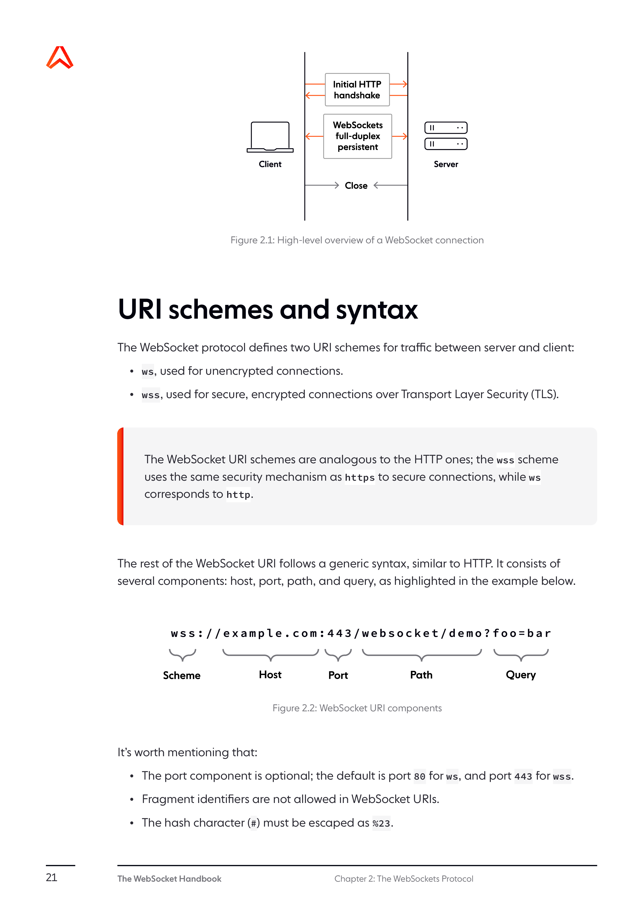
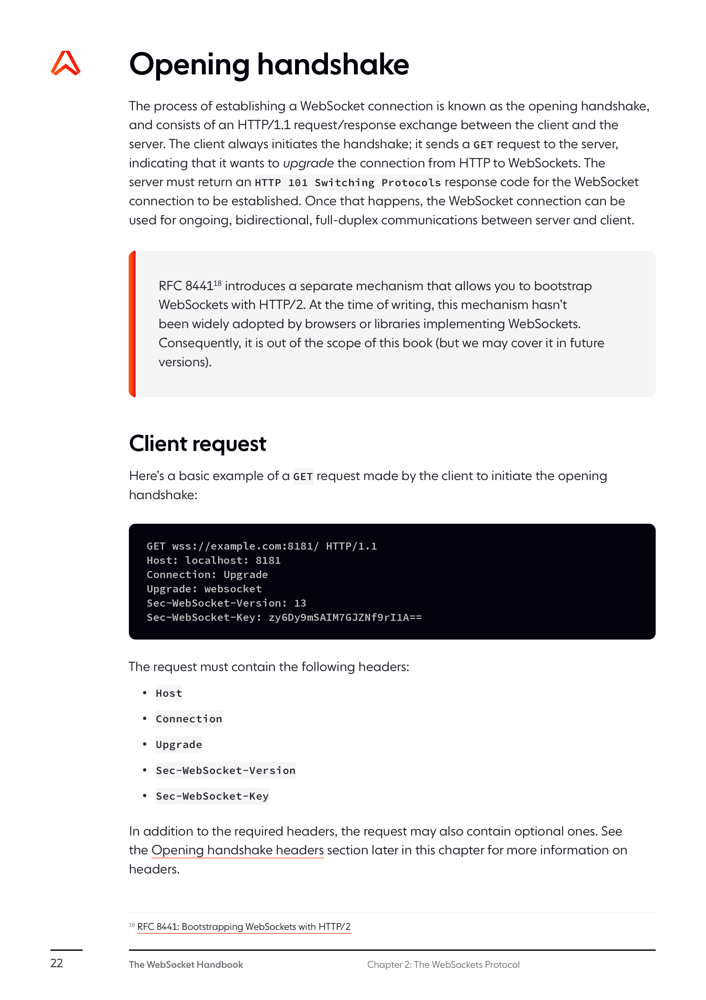
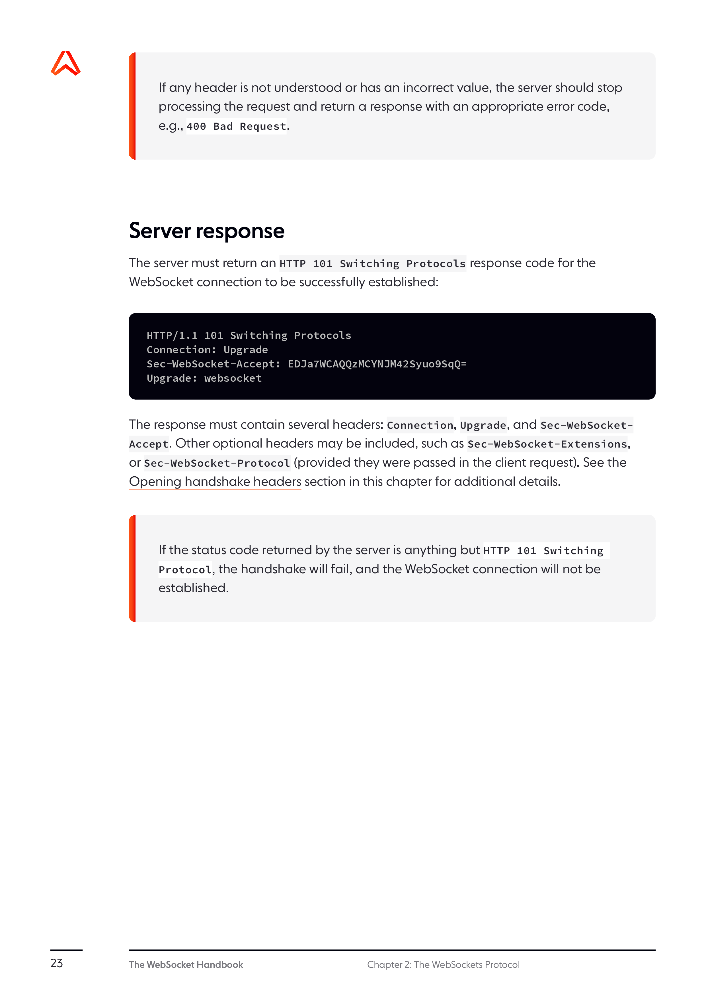
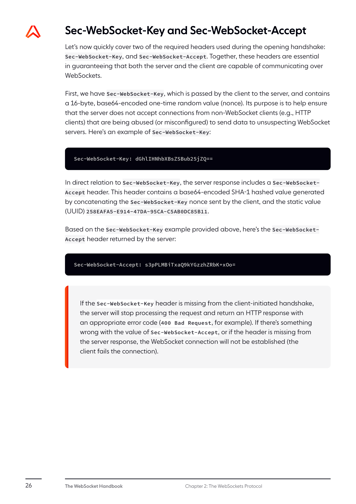
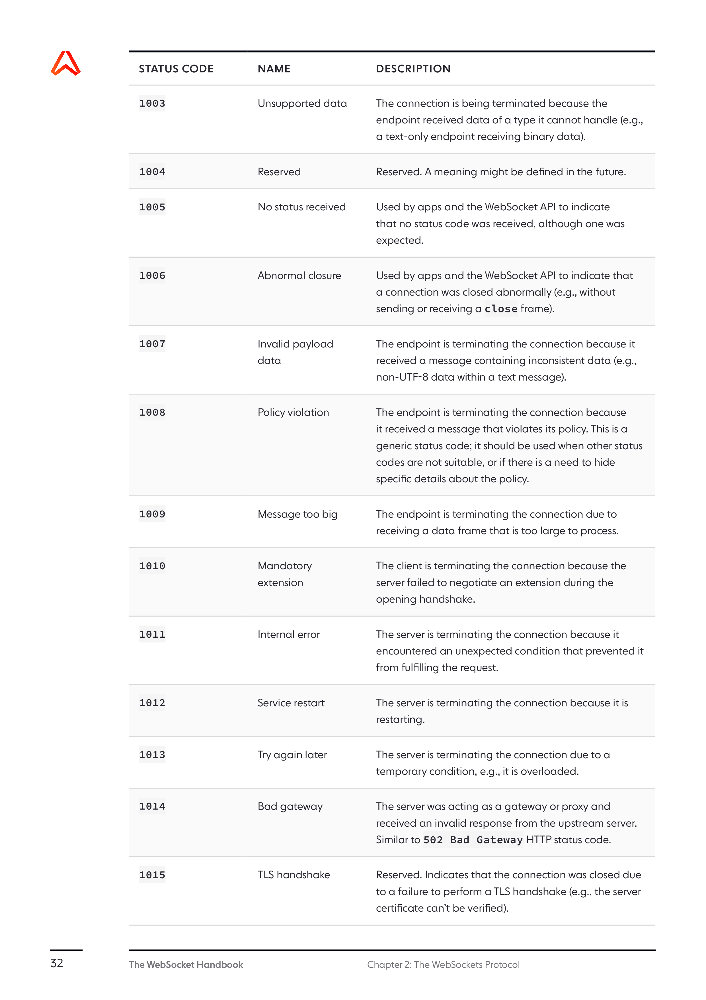

In December 2011, the Internet Engineering Task Force (IETF) standardized the
WebSocket protocol through [RFC 6455](https://tools.ietf.org/html/rfc6455). In
coordination with IETF, the Internet Assigned Numbers Authority (IANA) maintains
the
[WebSocket Protocol Registries](https://www.iana.org/assignments/websocket/websocket.xml),
which define many of the codes and parameter identifiers used by the protocol.

This chapter covers key considerations related to the
[WebSocket protocol](https://ably.com/topic/websockets), as described in
RFC 6455. You'll find out how to establish a WebSocket connection and exchange
messages, what kind of data can be sent over WebSockets, what types of
extensions and subprotocols you can use to augment WebSockets.

## Protocol overview

The WebSocket protocol enables ongoing, full-duplex, bidirectional communication
between web servers and web clients over an underlying TCP connection.

In a nutshell, the base WebSocket protocol consists of an opening handshake
(upgrading the connection from HTTP to WebSockets), followed by data transfer.
After the client and server successfully negotiate the opening handshake, the
WebSocket connection acts as a persistent full-duplex communication channel
where each side can, independently, send data at will. Clients and servers
transfer data back and forth in conceptual units referred to as messages, which,
as we describe shortly, can consist of one or more frames. Once the WebSocket
connection has served its purpose, it can be terminated via a closing handshake.



## URI schemes and syntax

The WebSocket protocol defines two URI schemes for traffic between server and
client:

- **ws**, used for unencrypted connections.
- **wss**, used for secure, encrypted connections over Transport Layer Security
  (TLS).

The WebSocket URI schemes are analogous to the HTTP ones; the wss scheme uses
the same security mechanism as https to secure connections, while ws corresponds
to http.

The rest of the WebSocket URI follows a generic syntax, similar to HTTP. It
consists of several components: host, port, path, and query, as highlighted in
the example below.



It's worth mentioning that:

- The port component is optional; the default is port 80 for ws, and port 443
  for wss.
- Fragment identifiers are not allowed in WebSocket URIs.
- The hash character (#) must be escaped as %23.

## Opening handshake

The process of establishing a WebSocket connection is known as the opening
handshake, and consists of an HTTP/1.1 request/response exchange between the
client and the server. The client issues a WebSocket handshake request, which is
just a specially formatted HTTP GET request. The server, if it supports the
WebSocket protocol and is willing to establish a connection with the client,
responds with a WebSocket handshake response.



### Client handshake request

A WebSocket handshake request is a specially formatted HTTP GET request. Here's
a sample client WebSocket handshake request:

```http
GET /chat HTTP/1.1
Host: example.com:8000
Upgrade: websocket
Connection: Upgrade
Sec-WebSocket-Key: dGhlIHNhbXBsZSBub25jZQ==
Sec-WebSocket-Version: 13
```

The request includes the following headers:

- `Upgrade: websocket` - indicates that the client wants to upgrade the
  connection to use the WebSocket protocol.
- `Connection: Upgrade` - tells proxies or other intermediaries to also upgrade
  the connection.
- `Sec-WebSocket-Key` - a Base64-encoded random value that helps the server
  prove it's a WebSocket-capable server.
- `Sec-WebSocket-Version` - the version of the WebSocket protocol the client
  wishes to use.

In addition to these mandatory headers, the client might also include:

- `Sec-WebSocket-Protocol` - a list of subprotocols that the client wishes to
  speak, ordered by preference.
- `Sec-WebSocket-Extensions` - a list of extensions the client wishes to use.

### Server handshake response

If the server understands the WebSocket protocol and accepts the request to
upgrade, it sends back a HTTP response like this:

```http
HTTP/1.1 101 Switching Protocols
Upgrade: websocket
Connection: Upgrade
Sec-WebSocket-Accept: s3pPLMBiTxaQ9kYGzzhZRbK+xOo=
```

The response includes:

- `HTTP/1.1 101 Switching Protocols` - indicates the successful upgrade from
  HTTP to WebSocket.
- `Upgrade: websocket` - confirms the protocol upgrade.
- `Connection: Upgrade` - indicates that the connection has been upgraded.
- `Sec-WebSocket-Accept` - a value calculated from the client's
  Sec-WebSocket-Key, which helps verify that the server understood the WebSocket
  handshake request.

If the client requested a subprotocol, the server includes the
`Sec-WebSocket-Protocol` header with the name of the chosen subprotocol. If the
client requested extensions, the server may include the
`Sec-WebSocket-Extensions` header with the extensions it has agreed to use.

## Data framing

Once the WebSocket connection is established, the client and server can send
WebSocket data frames back and forth in either direction. Each message consists
of one or more frames. There are different types of frames:

- Text frames - contain UTF-8 encoded text data
- Binary frames - contain binary data
- Control frames - used for protocol-level signaling, such as pings, pongs, and
  close frames

### WebSocket frame structure

The base framing protocol breaks down a frame into the following components:



- `FIN` bit - indicates whether this is the final fragment in a message (1) or
  not (0).
- `RSV1`, `RSV2`, `RSV3` bits - reserved for extensions; must be 0 unless an
  extension is negotiated.
- `Opcode` (4 bits) - indicates the type of frame:
  - 0x0: continuation frame
  - 0x1: text frame
  - 0x2: binary frame
  - 0x8: connection close
  - 0x9: ping
  - 0xA: pong
- `MASK` bit - indicates whether the payload data is masked (1) or not (0).
- `Payload length` - the length of the payload data.
- `Masking key` (optional, 32 bits) - included only if the MASK bit is set to 1.
- `Payload data` - the actual data.

## Message fragmentation

WebSocket messages can be split into multiple frames, which can be useful for
sending large messages without having to buffer the entire message on the
sender's side. When a message is fragmented:

1. The first frame has an opcode indicating the message type (text or binary).
2. Following frames have an opcode of 0 (continuation frame).
3. The final frame has the FIN bit set to 1.

## Control frames

Control frames are used for protocol-level signaling within the WebSocket
connection. They are always unfragmented (FIN bit set to 1) and have a maximum
payload length of 125 bytes. The most common control frames are:

### Ping/Pong frames

Ping (opcode 0x9) and Pong (opcode 0xA) frames are used for checking that the
connection is still alive or for measuring latency. When a peer receives a Ping
frame, it must send back a Pong frame with the same payload as soon as possible.

### Close frames

Close frames (opcode 0x8) are used to initiate the closing handshake, which
indicates the beginning of the process to terminate the WebSocket connection.

## Closing handshake

The closing handshake is initiated when either the client or server sends a
close frame. The peer that receives the close frame should send back another
close frame in response. After sending a close frame, the peer should not send
any more data frames. After both sides have exchanged close frames, the TCP
connection is closed.



A close frame may contain a status code and a reason for closing in its payload.
The status code is a 16-bit unsigned integer. Some of the most common status
codes are:

- 1000: Normal closure
- 1001: Going away
- 1002: Protocol error
- 1003: Unsupported data
- 1008: Policy violation
- 1011: Internal error

## Protocol extensions

The WebSocket protocol can be extended through the use of extensions. Extensions
allow for additional capabilities or modifications to the base WebSocket
protocol. Extensions are negotiated during the opening handshake.

Some common extensions include:

- **Compression extensions** - reduce the size of messages to save bandwidth.
- **Multiplexing extension** - allows multiple logical WebSocket connections to
  be multiplexed over a single transport connection.

## Subprotocols

Subprotocols define the high-level semantics of the communication over
WebSockets. They are application-specific protocols layered on top of
WebSockets. Common subprotocols include:

- **MQTT over WebSockets** - for IoT and messaging applications.
- **STOMP over WebSockets** - for messaging applications.
- **JSON-RPC over WebSockets** - for remote procedure calls.

## Security considerations

When using WebSockets, consider the following security aspects:

- Always use the secure WebSocket protocol (wss://) for production applications.
- Validate all incoming messages on the server to protect against malicious
  input.
- Implement proper authentication and authorization.
- Be aware of potential cross-site WebSocket hijacking (CSWSH) attacks.
- Configure appropriate timeouts and resource limits to prevent
  denial-of-service attacks.

## Browser compatibility

Modern browsers widely support the WebSocket protocol, including:

- Chrome 4+
- Firefox 4+
- Safari 5+
- Edge 12+
- Internet Explorer 10+
- Opera 10.7+

For older browsers that don't support WebSockets, polyfill libraries like SockJS
or Socket.IO can provide fallback transport mechanisms.

## WebSocket implementations

There are many server and client implementations of the WebSocket protocol
across various programming languages. Some popular ones include:

- **JavaScript**: [ws](https://github.com/websockets/ws) (Node.js), native
  Browser
  [WebSocket](https://developer.mozilla.org/en-US/docs/Web/API/WebSocket)
- **Python**: [websockets](https://github.com/python-websockets/websockets),
  [autobahn](https://github.com/crossbario/autobahn-python)
- **Java**: [Tyrus](https://eclipse-ee4j.github.io/tyrus/),
  [Jetty](https://www.eclipse.org/jetty/)
- **C#**: [SignalR](https://dotnet.microsoft.com/apps/aspnet/signalr),
  [WebSocketSharp](https://github.com/sta/websocket-sharp)
- **Go**: [Gorilla WebSocket](https://github.com/gorilla/websocket)
- **Ruby**: [EventMachine WebSocket](https://github.com/igrigorik/em-websocket)
- **PHP**: [Ratchet](http://socketo.me/)

When choosing an implementation, consider factors like performance, feature
completeness, active maintenance, and community support.
