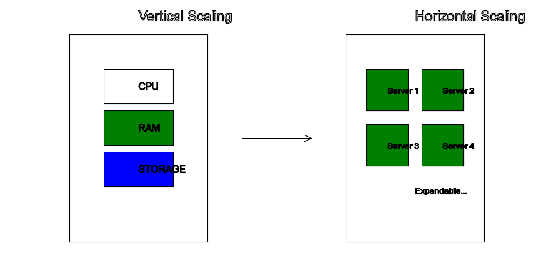
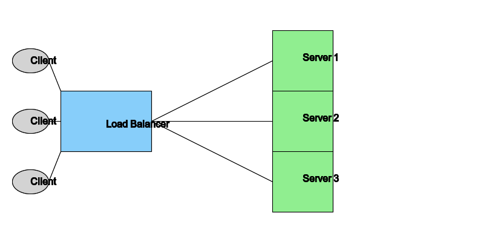
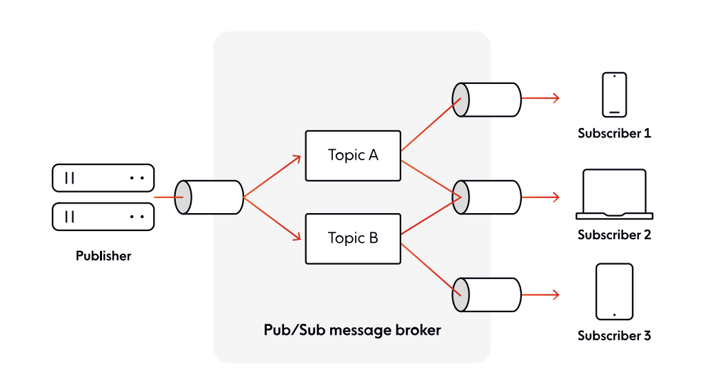

This chapter covers the main aspects to consider when you set out to build a
system at scale. By this, I mean a system to handle thousands or even millions
of concurrent end-user devices as they connect, consume, and send messages over
WebSockets. As you will see,
[scaling WebSockets](https://ably.com/topic/the-challenge-of-scaling-websockets)
is non-trivial, and involves numerous engineering decisions and technical
trade-offs.

## The scalability of your server layer

There are two main paths you can take to scale your server layer:

- **Vertical scaling**. Also known as scaling up, it adds more power (e.g., CPU,
  RAM) to an existing machine.
- **Horizontal scaling**. Also known as scaling out, it involves adding more
  machines to the network, which share the processing workload.

_Figure 5.1: Vertical and horizontal scaling_

At first glance, vertical scaling seems attractive, as it's easier to implement
and maintain than horizontal scaling. You might even ask yourself: how many
WebSocket connections can one server handle? However, that's rarely the right
question to ask, and that's because scaling up has some serious practical
limitations.

Let's look at a hypothetical example to demonstrate these drawbacks. Imagine
you've developed an interactive virtual events platform with WebSockets that's
being used by tens of thousands of users, with more and more joining every day.
This translates into an ever-growing number of WebSocket connections your server
layer needs to handle.

However, since you are only using one machine, there's a finite amount of
resources you can add to it, which means you can only scale your server up to a
finite capacity. Furthermore, what happens if, at some point, the number of
concurrent WebSocket connections proves to be too much to handle for just one
machine? Or what happens if you need to upgrade your server? With vertical
scaling, you have a single point of failure, which would severely affect the
availability of your system and the uptime of your virtual events platform.

> In contrast, horizontal scaling is a more available model in the long run.
> Even if a server crashes or needs to be upgraded, you are in a much better
> position to protect your system's overall availability since the workload of
> the machine that failed is distributed to the other nodes in the network.

Of course, horizontal scaling comes with its own complications — it involves a
more complex architecture, additional infrastructure to manage, load balancing,
and automatically syncing message data and connection state across multiple
WebSocket servers in milliseconds (more about these topics is covered later in
this chapter).

Despite its increased complexity, horizontal scaling is worth pursuing, as it
allows you to scale limitlessly (in theory). This makes it a superior
alternative to vertical scaling. So, instead of asking how many connections can
a server handle, a better question would be: how many servers can I distribute
the workload to?

> In addition to horizontal scaling, you should also consider the elasticity of
> your server layer. System-breaking complications can arise when you expose an
> inelastic server layer to the public internet, a volatile and unpredictable
> source of traffic. To successfully handle WebSockets at scale, you need to be
> able to dynamically (automatically) add more servers into the mix so that your
> system can quickly adjust and deal with potential usage spikes at all times.

## Load balancing

[Load balancing WebSockets](https://ably.com/topic/when-and-how-to-load-balance-websockets-at-scale)
is the process of distributing incoming network traffic (WebSocket connections
in our case) across a group of backend servers (usually called a server farm).
When you scale horizontally, your load balancing strategy is fundamental.

A load balancer — which can be a physical device, a virtualized instance running
on specialized hardware, or a software process — acts as a "traffic cop".
Sitting between clients and your backend server farm, the load balancer receives
and then routes incoming connections to available servers capable of handling
them.

 _Figure 5.2: Load
balancing_

Load balancers detect the health of backend resources and do not send traffic to
servers that cannot deal with additional load. If a server goes down, the load
balancer redirects its traffic to the remaining operational servers. When a new
server is added to the farm, the load balancer automatically starts distributing
traffic to it.

The goal of an effective load balancing strategy is to:

- Provide fault tolerance, high availability, and reliability.
- Ensure no one server is overworked, which can degrade performance.
- Minimize server response time and maximize throughput.
- Allow you to flexibly add or remove servers, as demand dictates.

You can perform load balancing at different layers of the Open Systems
Interconnection (OSI) Model:

- **Layer 4 (L4)**. Transport-level load balancing. This means load balancers
  can make routing decisions based on the TCP or UDP ports that packets use,
  along with their source and destination IP addresses. The contents of the
  packets themselves are not inspected.
- **Layer 7 (L7)**. Application-level load balancing. At this layer, load
  balancers can evaluate a broader range of data than at L4, including HTTP
  headers and SSL session IDs. L7 load balancing is generally more sophisticated
  and more resource-intensive, but it can also be more efficient by allowing the
  load balancer to make routing decisions based on the content of the message.

Both L4 and L7 load balancing are commonly used in modern architectures. Layer 4
load balancing is ideal for simple packet-level load balancing, and it's usually
faster and more secure (because message data isn't inspected). In comparison,
Layer 7 load balancing is more expensive, but it's capable of smart routing
based on URL (something you can't do with L4 load balancing). Large distributed
systems often use a two-tiered L4/L7 load balancing architecture for internet
traffic.

### Load balancing algorithms

A load balancer will follow an algorithm to determine how to distribute requests
across your server farm. There are various options to consider and choose from.
The table below presents some of the most commonly used ones:

| ALGORITHM               | ABOUT                                                                                                                                                                                                                                                                                                  |
| ----------------------- | ------------------------------------------------------------------------------------------------------------------------------------------------------------------------------------------------------------------------------------------------------------------------------------------------------ |
| Round robin             | Involves routing connections to available servers sequentially, on a cyclical basis. For a simplified example, let's assume we have two servers, A and B. The first connection goes to server A, the second one goes to server B, the third one goes to server A, the fourth one goes to B, and so on. |
| Least connections       | A new connection is routed to the server with the least number of active connections.                                                                                                                                                                                                                  |
| Least bandwidth         | A new connection is routed to the server currently serving the least amount of traffic as measured in megabits per second (Mbps).                                                                                                                                                                      |
| Least response time     | A new connection is routed to the machine that takes the least amount of time to respond to a health monitoring request (the response speed is used to indicate how loaded a server is). Some load balancers might also factor in the number of active connections on each server.                     |
| Hashing methods         | The routing decision is made based on a hash of various bits of data from the incoming connection. This may include information such as port number, domain name, and IP address.                                                                                                                      |
| Random with two choices | The load balancer randomly picks two servers from your farm and routes a new connection to the machine with the fewest active connections.                                                                                                                                                             |
| Custom load             | The load balancer queries the load on individual servers using something like the Simple Network Management Protocol (SNMP), and assigns a new connection to the machine with the best load metrics. You can define various metrics to look at, such as CPU usage, memory, and response time.          |

### Table 5.1: Load balancing algorithms

> You should select a load balancing algorithm depending on the specifics of
> your WebSocket use case. In scenarios where you have the exact same number of
> messages being sent to all clients (for example, live score updates for all
> those following a tennis match), and your servers have roughly identical
> computing capabilities and storage capacity, you can use the round robin
> approach, which is easier to implement compared to some other alternatives.
> However, if, for example, you are developing a chat solution, some WebSocket
> connections will be more resource-intensive, due to certain end-users being
> chattier. In this case, a round robin strategy might not be the best way to
> go, since you would in effect be distributing load unevenly across your server
> farm. In such a context, you would be better off using an algorithm like least
> bandwidth.

Here are other aspects to bear in mind when you're load balancing WebSockets:

### Falling back to alternative transports

You might come across scenarios where you won't be able to use WebSockets (for
example, some corporate firewalls and networks block WebSocket connections).
When this happens, your system needs to be able to fall back to another
transport — usually an HTTP-based technique, like Comet long polling. This means
that your server layer needs to "understand" both WebSockets, as well as all the
fallbacks you are using.

Your server layer must be prepared to quickly adjust to falling back to a less
efficient transport, which usually means increased load. You should bear in mind
that your ideal load balancing strategy for WebSockets might not always be the
right one for HTTP requests; after all, stateful WebSockets and stateless HTTP
are fundamentally different. When you design your system, you must ensure it's
able to successfully load balance WebSockets, as well as any HTTP fallbacks you
support (you might want to have different server farms to handle WebSocket vs.
non-WebSocket traffic).

### Sticky sessions

One could argue that WebSockets are sticky by default (in the sense that there's
a persistent connection between server and client). However, this doesn't mean
that you are forced to use sticky load balancing (where the load balancer
repeatedly routes traffic from a client to the same destination server). In
fact, sticky load balancing is a rather fragile approach (there's always the
risk that a server will fail), making it hard to rebalance load. Rather than
using sticky load balancing, which inherently assumes that a client will always
stay connected to the same server, it's more reliable to use non-sticky
sessions, and have a mechanism that allows your servers to share connection
state between them. This way, stream continuity can be ensured without the need
for a WebSocket connection to always be linked to the exact same server.

## Architecting your system for scale

When you build apps with WebSockets for end-users connecting over the public
internet, you often won't be able to predict the number of
concurrently-connected devices. You should design your system in such a way that
it's able to handle an unknown (but potentially very high) and volatile number
of simultaneous users.

> To handle unpredictability, you should architect your system based on a
> pattern designed for huge scalability. One of the most popular and dependable
> choices is the pub/sub pattern.

In a nutshell, pub/sub provides a framework for message exchange between
publishers (typically your server) and subscribers (often, end-user devices).
Publishers and subscribers are unaware of each other, as they are decoupled by a
message broker, which usually groups messages into channels (or topics).
Publishers send messages to channels, while subscribers receive messages by
subscribing to relevant channels.

_Figure 5.3: The pub/sub pattern_

The pub/sub pattern's decoupled nature means your apps can theoretically scale
to limitless subscribers. A significant advantage of adopting the pub/sub
pattern is that you often have only one component that has to deal with scaling
WebSocket connections — the message broker. As long as the message broker can
scale predictably and reliably, it's unlikely you'll have to add additional
components or make any other changes to your system to deal with the
unpredictable number of concurrent users connecting over WebSockets.

Here are some other benefits you gain by using pub/sub:

- **Smoother scalability**. Systems using pub/sub are scalable without the fear
  of breaking functionality because communication logic and business logic are
  separate entities. Software architects can redesign the message broker's
  channel architecture without the worry of breaking the business logic.
- **Elasticity**. There's no need to pre-define a set number of publishers or
  subscribers. They can be added to a required channel depending on the usage.
- **Ease of development & fast integration**. Pub/sub is agnostic to programming
  language and communication protocol, which enables disparate components of a
  system to be integrated faster compared to legacy alternatives.

There are numerous projects built with WebSockets and pub/sub, and plenty of
open-source libraries and commercial solutions combining these two elements, so
it's unlikely you'll have to build your own WebSockets + pub/sub capability from
scratch. Examples of open-source solutions you can use include: Socket.IO with
the Redis pub/sub adapter, SocketCluster, or Django Channels. Of course, when
choosing an open-source solution, you have to deploy it, manage it, and scale it
yourself — this is, without a doubt, a tough engineering challenge.
Alternatively, you can use a commercial platform like [Ably](https://ably.com/)
that handles the complexities of scaling WebSockets for you.

## Fallback transports

Despite benefiting from widespread platform support, WebSockets suffer from some
networking issues. Here are some of the problems you may come across:

- Some proxies don't support the WebSocket protocol or terminate persistent
  connections.
- Some corporate firewalls, VPNs, and networks block specific ports, such as 443
  (the standard web access port that supports secure WebSocket connections).
- WebSockets are still not entirely supported across all browsers.

Imagine you've developed a CRM, marketing, and sales platform for tens of
thousands of business users, where you have realtime features such as chat and
live dashboards that are powered by WebSockets. But some users might be
connecting from restrictive corporate networks that block or break WebSocket
connections. So what do you do to ensure your product is available to your
customers, knowing that you may not be able to use WebSockets in all situations?

> If you foresee clients connecting from within corporate firewalls or otherwise
> tricky sources, you need to consider supporting fallback transports.

Most WebSocket solutions have fallback support baked in. For example, Socket.IO,
one of the most popular open-source WebSocket libraries out there, will opaquely
try to establish a WebSocket connection if possible, and will fall back to HTTP
long polling if not.

Another example is SockJS, which supports a large number of streaming and
polling fallbacks, including xhr-polling (long-polling using cross-domain XHR)
and eventsource (Server-Sent Events).

> See Chapter 4: Building a Web App with WebSockets for details on building a
> realtime app with SockJS that falls back to Comet long polling when WebSockets
> can't be used.
