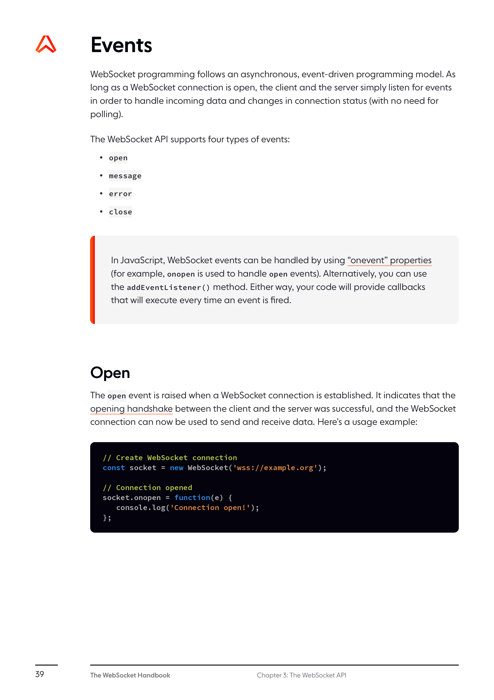
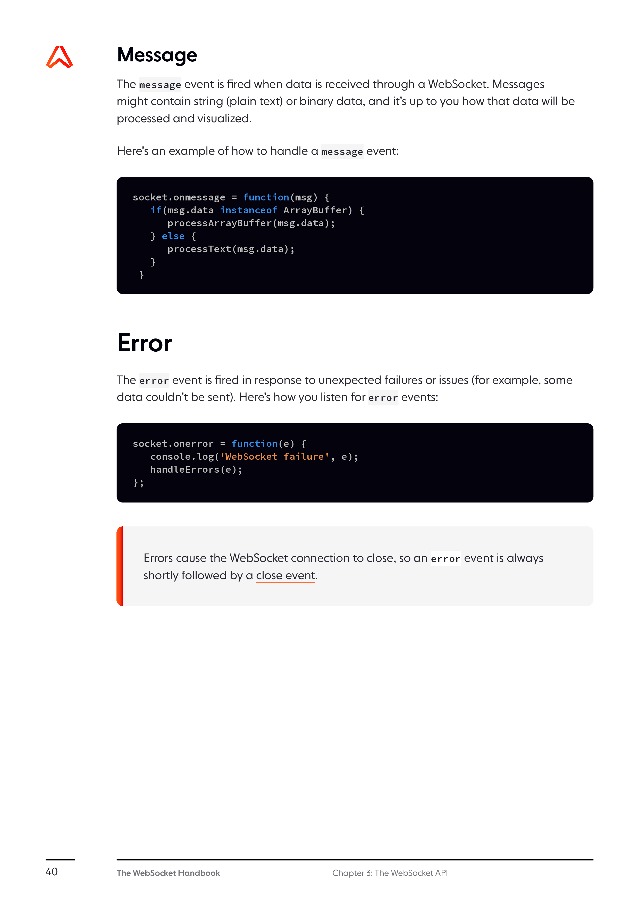

# The WebSocket API (WebSockets)

The WebSocket API is an advanced technology that makes it possible to open a persistent two-way, full-duplex communication channel between a web client and a server. With this API, you can send messages to a server and receive event-driven responses without having to poll the server for a reply.

Defined in the [HTML Living Standard](https://html.spec.whatwg.org/multipage/web-sockets.html), the WebSocket API enables you to build web applications that are truly realtime and less resource-intensive on both the client and the server compared to HTTP techniques.

Almost all modern browsers support the WebSocket API. Additionally, there are plenty of frameworks and libraries — both open-source and commercial solutions — that implement WebSocket APIs.

## The WebSocket Server

A WebSocket server can be written in any server-side programming language that is capable of Berkeley sockets. The server listens for incoming WebSocket connections using a standard TCP socket. Once the opening handshake has been negotiated, the server must be able to send, receive, and process WebSocket messages.

## The WebSocket Interface



The WebSocket interface is the primary API for connecting to a WebSocket server and then sending and receiving data on the connection.

### Constructor

```javascript
const socket = new WebSocket(url[, protocols]);
```

The WebSocket constructor contains a required parameter — the URL to the WebSocket server. Additionally, the optional `protocols` parameter may also be included to indicate one or more WebSocket subprotocols (application-level protocols) that can be used during the client-server communication.

**Parameters:**

- `url`: The URL to which to connect; this should be the URL to which the WebSocket server will respond.
- `protocols` (optional): Either a single protocol string or an array of protocol strings. These strings are used to indicate sub-protocols, so that a single server can implement multiple WebSocket sub-protocols (for example, you might want one server to be able to handle different types of interactions depending on the specified protocol).

**Examples:**

```javascript
// Creating a WebSocket connection
const socket = new WebSocket('wss://example.org');

// Creating a WebSocket connection with a specific protocol
const socket = new WebSocket('wss://example.org', 'myCustomProtocol');

// Creating a WebSocket connection with multiple protocols
const socket = new WebSocket('wss://example.org', ['protocol1', 'protocol2']);
```

### Connection states

The WebSocket object has a property called `readyState` that represents the connection state. The state starts at `CONNECTING` (0) as soon as the WebSocket object is created. It changes to `OPEN` (1) when the connection is established, allowing data to be transmitted. If the connection fails, the state becomes `CLOSED` (3).



The WebSocket `readyState` property can have the following values:

| Constant | Value | Description |
|----------|-------|-------------|
| `WebSocket.CONNECTING` | 0 | The connection is not yet open. |
| `WebSocket.OPEN` | 1 | The connection is open and ready to communicate. |
| `WebSocket.CLOSING` | 2 | The connection is in the process of closing. |
| `WebSocket.CLOSED` | 3 | The connection is closed or couldn't be opened. |

### Properties

The WebSocket interface also has the following properties:

#### `WebSocket.url` (read-only)

Returns the absolute URL of the WebSocket as provided in the constructor.

#### `WebSocket.protocol` (read-only)

Returns the name of the sub-protocol the server selected; this will be one of the strings specified in the `protocols` parameter when creating the WebSocket object.

#### `WebSocket.readyState` (read-only)

Returns the current state of the WebSocket connection.

#### `WebSocket.bufferedAmount` (read-only)

Returns the number of bytes of data that have been queued using `send()` but not yet transmitted to the network. This value resets to zero once all queued data has been sent. This value does not reset to zero when the connection is closed; if you keep calling `send()`, this will continue to climb.

#### `WebSocket.binaryType`

A string indicating the type of binary data being transmitted by the connection. This should be either "blob" if DOM `Blob` objects are being used or "arraybuffer" if `ArrayBuffer` objects are being used.

#### `WebSocket.extensions` (read-only)

Returns the extensions selected by the server. This is currently only the empty string or a list of extensions as negotiated by the connection.

### Methods

The WebSocket API includes the following methods:

#### `WebSocket.send(data)`

Enqueues data to be transmitted to the server.

**Parameters:**

- `data`: The data to send to the server. It can be a string, a `Blob`, an `ArrayBuffer`, or an `ArrayBufferView`.

**Example:**

```javascript
// Sending a text message
socket.send('Hello server!');

// Sending a binary message
const binaryData = new Uint8Array([1, 2, 3, 4]);
socket.send(binaryData.buffer);
```

#### `WebSocket.close([code[, reason]])`

Closes the WebSocket connection or connection attempt, if any. If the connection is already closed, this method does nothing.

**Parameters:**

- `code` (optional): A numeric value indicating the status code explaining why the connection is being closed. If this parameter is not specified, a default value of 1000 (normal closure) is used.
- `reason` (optional): A human-readable string explaining why the connection is closing. This string must be no longer than 123 bytes of UTF-8 text (not characters).

**Example:**

```javascript
// Close the connection
socket.close();

// Close the connection with a specific code and reason
socket.close(1000, 'Normal closure');
```

### Events

The WebSocket API is event-driven. You can register event listeners on the WebSocket object to be notified of events such as the connection being established, messages being received, or the connection being closed.


#### `open`

Fired when the connection is established.

```javascript
socket.onopen = (event) => {
  console.log('Connection established');
  // You can now send data
  socket.send('Hello, server!');
};

// Alternatively, you can use the addEventListener method
socket.addEventListener('open', (event) => {
  console.log('Connection established');
  socket.send('Hello, server!');
});
```

#### `message`

Fired when data is received from the server.

```javascript
socket.onmessage = (event) => {
  console.log('Message from server:', event.data);
};

// Alternatively, you can use the addEventListener method
socket.addEventListener('message', (event) => {
  console.log('Message from server:', event.data);
});
```

#### `error`

Fired when an error occurs.

```javascript
socket.onerror = (event) => {
  console.error('WebSocket error:', event);
};

// Alternatively, you can use the addEventListener method
socket.addEventListener('error', (event) => {
  console.error('WebSocket error:', event);
});
```

#### `close`

Fired when the connection is closed.

```javascript
socket.onclose = (event) => {
  console.log('Connection closed with code:', event.code);
};

// Alternatively, you can use the addEventListener method
socket.addEventListener('close', (event) => {
  console.log('Connection closed with code:', event.code);
  console.log('Close reason:', event.reason);
});
```

## Working with different data types

The WebSocket API supports both text and binary data formats:

### Text Data

Text data is sent as strings using UTF-8 encoding.

```javascript
// Sending text data
socket.send('Hello, server!');

// Handling text data
socket.onmessage = (event) => {
  if (typeof event.data === 'string') {
    console.log('Received text message:', event.data);
  }
};
```

### Binary Data

Binary data can be sent as `Blob`, `ArrayBuffer`, or `ArrayBufferView` objects.

```javascript
// Setting the binary type to ArrayBuffer
socket.binaryType = 'arraybuffer';

// Sending binary data
const binaryData = new Uint8Array([1, 2, 3, 4]);
socket.send(binaryData.buffer);

// Handling binary data
socket.onmessage = (event) => {
  if (event.data instanceof ArrayBuffer) {
    const view = new Uint8Array(event.data);
    console.log('Received binary message:', view);
  }
};
```

## Complete Example

Here's a complete example showing how to create a WebSocket connection, send messages, and handle events:

```javascript
// Create a new WebSocket connection
const socket = new WebSocket('wss://echo.websocket.org');

// Handle connection open
socket.onopen = (event) => {
  console.log('Connection established');

  // Send a message
  socket.send('Hello, WebSocket server!');
};

// Handle messages
socket.onmessage = (event) => {
  console.log('Message received:', event.data);

  // Close the connection after receiving a message
  socket.close(1000, 'Work complete');
};

// Handle errors
socket.onerror = (event) => {
  console.error('WebSocket error:', event);
};

// Handle connection close
socket.onclose = (event) => {
  console.log('Connection closed. Code:', event.code, 'Reason:', event.reason);
};
```

## Browser Compatibility

The WebSocket API is supported by all modern browsers:

- Chrome 4+
- Firefox 4+
- Safari 5+
- Edge 12+
- Opera 10.7+
- iOS Safari 4.2+
- Android Browser 4.4+
- Chrome for Android 56+

For older browsers that don't support WebSockets natively, libraries like [SockJS](https://github.com/sockjs/sockjs-client) or [Socket.IO](https://socket.io/) can provide fallback transport mechanisms.

## Security Considerations

When using the WebSocket API, consider the following security aspects:

- Always use secure WebSocket (`wss://`) in production applications.
- Validate and sanitize all received messages before processing.
- Implement proper authentication and authorization.
- Be aware of potential cross-site WebSocket hijacking attacks.
- Implement appropriate timeouts and reconnection strategies.

## Related Interfaces

### CloseEvent

The `CloseEvent` interface represents an event sent to the `onclose` event handler when the WebSocket connection is closed.

#### Properties

- `CloseEvent.code`: The close code (see [WebSocket Close Codes](#websocket-close-codes)).
- `CloseEvent.reason`: The reason the server gave for closing the connection.
- `CloseEvent.wasClean`: A boolean indicating whether the connection was closed cleanly.

### MessageEvent

The `MessageEvent` interface represents an event sent to the `onmessage` event handler when a message is received from the server.

#### Properties

- `MessageEvent.data`: The data sent by the server. This can be a string, a `Blob`, or an `ArrayBuffer`, depending on the `binaryType` property.
- `MessageEvent.origin`: The origin of the message.
- `MessageEvent.lastEventId`: A unique identifier for the event.
- `MessageEvent.source`: A reference to the source of the message.
- `MessageEvent.ports`: An array of MessagePort objects representing the ports associated with the channel the message is being sent through.

## WebSocket Close Codes

When a WebSocket connection is closed, a status code is set to indicate the reason for closing. The most common status codes are:

| Code | Name | Description |
|------|------|-------------|
| 1000 | Normal Closure | The connection was closed normally. |
| 1001 | Going Away | The endpoint is going away (e.g., server shutdown or browser navigating away). |
| 1002 | Protocol Error | The endpoint is terminating the connection due to a protocol error. |
| 1003 | Unsupported Data | The connection is being terminated because the endpoint received data of a type it cannot accept. |
| 1005 | No Status Received | Indicates that no status code was provided even though one was expected. |
| 1006 | Abnormal Closure | Used to indicate that a connection was closed abnormally. |
| 1007 | Invalid Frame Payload Data | The endpoint is terminating the connection because a message was received that contained inconsistent data. |
| 1008 | Policy Violation | The endpoint is terminating the connection because it received a message that violates its policy. |
| 1009 | Message Too Big | The endpoint is terminating the connection because a data frame was received that is too large. |
| 1010 | Mandatory Extension | The client is terminating the connection because it expected the server to negotiate one or more extension, but the server didn't. |
| 1011 | Internal Error | The server is terminating the connection because it encountered an unexpected condition that prevented it from fulfilling the request. |
| 1015 | TLS Handshake | Used to indicate that the connection was closed due to a failure to perform a TLS handshake. |

## Further Reading

- [HTML Living Standard - WebSockets](https://html.spec.whatwg.org/multipage/web-sockets.html)
- [RFC 6455 - The WebSocket Protocol](https://tools.ietf.org/html/rfc6455)
- [MDN Web Docs - WebSocket API](https://developer.mozilla.org/en-US/docs/Web/API/WebSocket)
